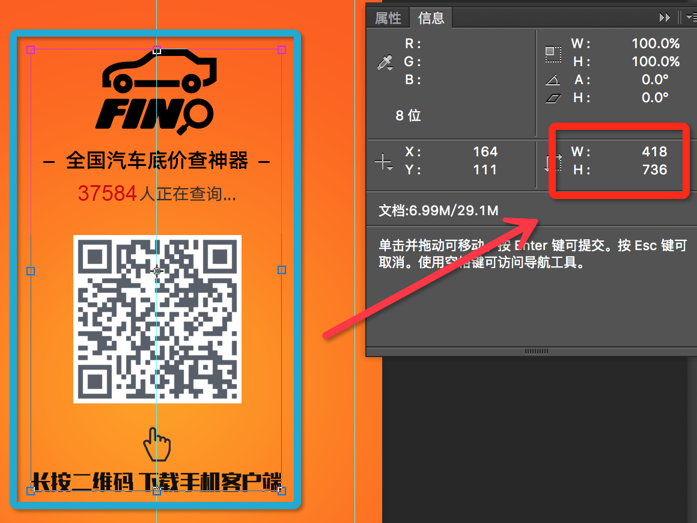
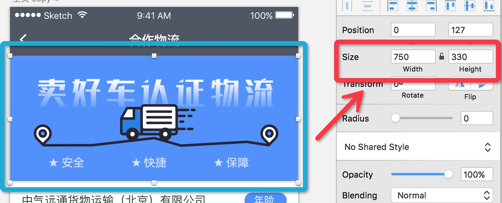
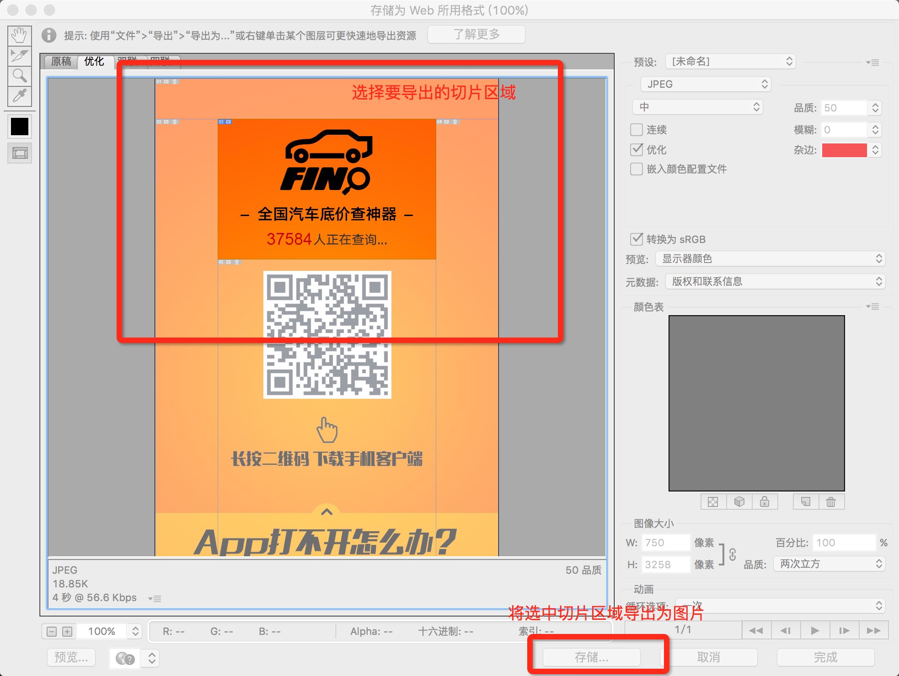
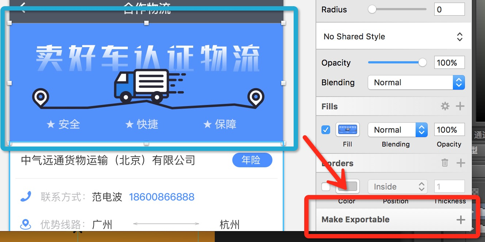
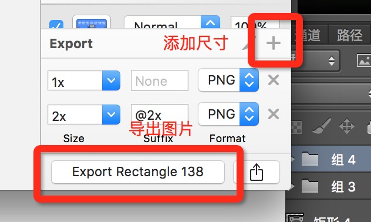

# 编写页面

我们公司的工作流程是：产品提需求；设计出图稿；前端做页面。

## 目录

* [切图](#切图)
	* [丈量尺寸](#丈量尺寸)
	* [测量间距](#测量间距)
	* [导出图片](#导出图片)
* [页面](#页面)
	* [分析结构](#分析结构)
	* [语义标签](#语义标签)
	* [移动页面](#移动页面)
	* [活动页面](#活动页面)

## 切图

设计师所出的设计稿，会是 Photoshop 或者 Sketch 的文件，所要编写的页面中的图标、图片等需要自己从设计稿中导出。虽然用的是不同的图形处理工具，但是步骤和方法都差不多。

### 丈量尺寸

在 Photoshop 中，在目标图层上按下 <kbd>command</kbd> + <kbd>T</kbd> 选中，然后 <kbd>fn</kbd> + <kbd>F8</kbd> 显示所选图层信息。



在 Sketch 中，选中想要查看的对象，右侧的属性面板中有相关信息。



### 测量间距

选中层后，在 Photoshop 中按住 <kbd>command</kbd> 或在 Sketch 中按住 <kbd>option</kbd>，光标移动到目标层上就会出现相关信息。

### 导出图片

在 Photoshop 中有两种导出图片的方式：

* 在图层列表中选中要导出的图层点击右键，选择「快速导出为 PNG」；
* 用切片工具切好区块后按 <kbd>option</kbd> + <kbd>shift</kbd> + <kbd>command</kbd> + <kbd>S</kbd>。



在 Sketch 中导出图片更简单些。选中图片点击右侧面板底部的「Make Exportable」出现导出选项。



选择要导出的尺寸，默认只有 1 倍大小的，然后导出图片。



## 页面

### 分析结构

根据设计稿上的元素所起到的作用在大脑中进行分解：

1. 布局：页头、页脚、主体、侧边栏等；
2. 元素：标题、段落、列表、表格、表单等。

上面只是简单粗暴地将一个页面的组成进行了分类分解，而实际应用当中会出现元素嵌套的情况。

对结构进行分析是为了选用合适的具备相应语义的标签，也是为了更好地去实现页面。

### 语义标签

在做页面时请选择符合设计稿所示元素的语义的标签，避免「DIV + CSS」，这样不仅人看起来舒服，搜索引擎也能够正确理解页面内容。

常用的文本类标签有：

* `<h1>` 等表示「标题」，`<h1>`、`<h2>` 和 `<h3>` 比较常用，其中 `<h1>` 在一个页面中基本只能有一个，每个 `<section>` 的子元素最好都带着 `<h2>`；
* `<p>` 表示「段落」，用于有一段文字的地方；
* `<a>` 表示「链接」，用于把当前页面与其他网络资源关联；
* `<strong>` 表示「很重要」，用于强调突出某段文本重要性的时候；
* `<span>` 没有什么语义，通常用于行内元素的划分。

常用于布局的标签如下：

* `<main>` 用于页面主体，在想用 `<div id="main">` 的时候请用这个标签；
* `<article>` 用于页面主要内容部分，在想用 `<div id="mainContent">` 的时候可以用；
* `<section>` 用于页面主要内容的分块，在想用 `<div class="Section">` 的时候可以用；
* `<header>` 用于以上提到的几个标签和 `<body>` 的子元素，代表着它们所在区域的头部，里面一般包含表示标题的标签和几个 `<p>`；
* `<footer>` 用于以上提到的几个标签和 `<body>` 的子元素，代表着它们所在区域的脚部。

表格相关的：

* `<table>` 表示「表格」；
* `<thead>`、`<tfoot>` 和 `<tbody>`分别表示表格的「表头」「脚注」和「主体」；
* `<tr>` 表示「行」；
* `<th>` 和 `<td>` 表示「单元格」，`<th>` 通常用作 `<thead>` 的子元素 `<tbody>` 中每行的第一个元素；
* `<col>` 和 `<colgroup>` 分别表示「列」和「列组」，用来控制每列的宽度。

表单相关的：

* `<form>` 表示「表单」；
* `<input>` 表示「输入框」，用来输入各种类型（由 `type` 属性指定）的信息；
* `<textarea>` 表示「文本域」，用来输入大段文本；
* `<select>` 表示「选择列表」，用来选择选项；
* `<option>` 表示「选项」；
* `<button>` 表示「按钮」；
* `<label>` 表示「标签」，用来标示并关联 `<input>`、`<textarea>` 和 `<select>`；
* `<fieldset>` 表示「字段集」，用来将 `<input>`、`<textarea>` 和 `<select>` 等字段标签分组；
* `<legend>` 用来标示字段集。

其他常用的标签有：

* `<ul>` 和 `<ol>` 表示「列表」，前者是「无序列表」，后者是「有序列表」；
* `<li>` 表示「条目」，用作 `<ul>` 和 `<ol>` 的子元素；
* `<dl>`、`<dt>` 和 `<dd>` 是「定义列表」及其「条目」和「描述」；
* `` 表示「图片」；
* `<nav>` 表示「导航」，用于有一系列页面链接的 `<a>` 时。

### 移动页面

在编写移动页面时，不使用 `px` 作为单位，取而代之的是 `rem`。然而，设计稿上所测量出来的数值的单位是 `px`，在编码时需要进行转换。

`rem` 的基准，`<html>` 的 `font-size` 是通过 JavaScript 代码根据一定的规则计算出来：

```js
(function (doc, win) {
  var docEl = doc.documentElement,
    resizeEvt = 'orientationchange' in window ? 'orientationchange' : 'resize',
    recalc = function () {
      var clientWidth = docEl.clientWidth;
      
      if (!clientWidth) return;
      
      docEl.style.fontSize = (24*clientWidth/750) + 'px';
    };
    
  if (!doc.addEventListener) return;
  
  win.addEventListener(resizeEvt, recalc, false);
  recalc();
})(document, window);
```

样式文件的源代码是用 Sass 编写的，已经定义了一个名为 `get_rem` 的 function，只需在调用时传入从设计稿上测量出数值即可：

```scss
p {
  font-size: get_rem(24);
}

img {
  width: get_rem(300);
  height: get_rem(120);
}
```

### 活动页面

时不时会有做活动页面的需求，这时的需求方可能是产品，也可能是运营。

活动页面是种较为特殊的页面。如果说开发功能是考验编程和架构能力，那么做活动页面就是考验切图和重构能力。相对来说，这个比较难些，因为**活动页面是要在尽可能短的时间内做出尽可能语义化的页面**。
