# 安装软件

在进行开发之前，要先安装以下软件：

* [麦宝](http://www.macabc.com/ "麦宝")
* [Sublime Text](http://www.sublimetext.com/ "Sublime Text")（或 Atom）
* IntelliJ IDEA（附[在线注册机](http://macabc.com/detail.htm?app_id=4 "IntelliJ IDEA 在线注册机")）
* git（需要事先安装 Xcode）
* SourceTree
* [VirtualBox](http://rj.baidu.com/soft/detail/25850.html) 与 Windows 镜像
* [Photoshop](#photoshop)
* Sketch

## Photoshop

## 下载

下载步骤：

前往 NAS 盘进入 `开发共享/mac常用软件`，下载 `Photoshop 2015 CC附破解.zip`。

### 安装步骤

1. 打开 dmg 文件
  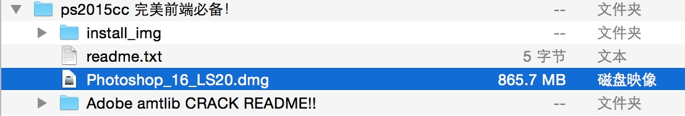
  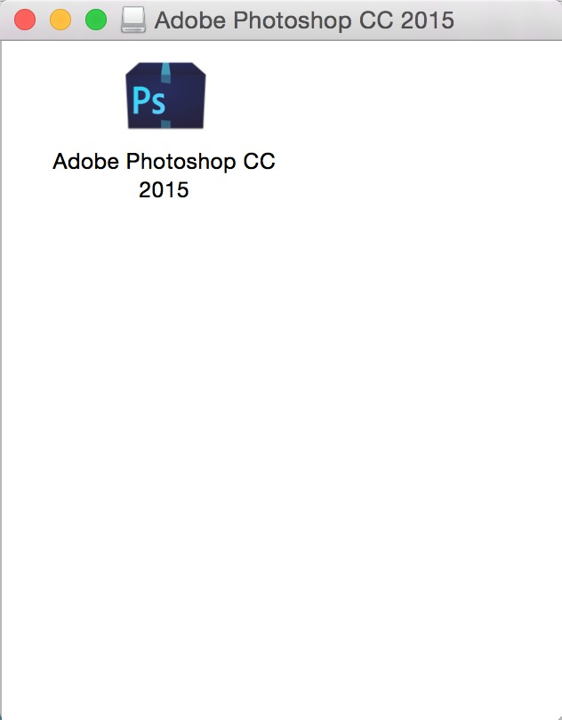

2. 断开网络
  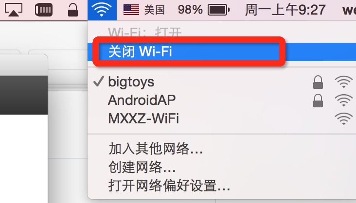

3. 双击 `Install.app`，开始初始化
  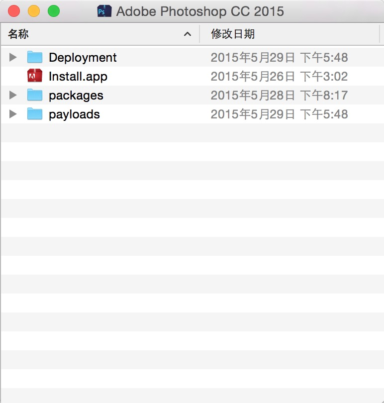
  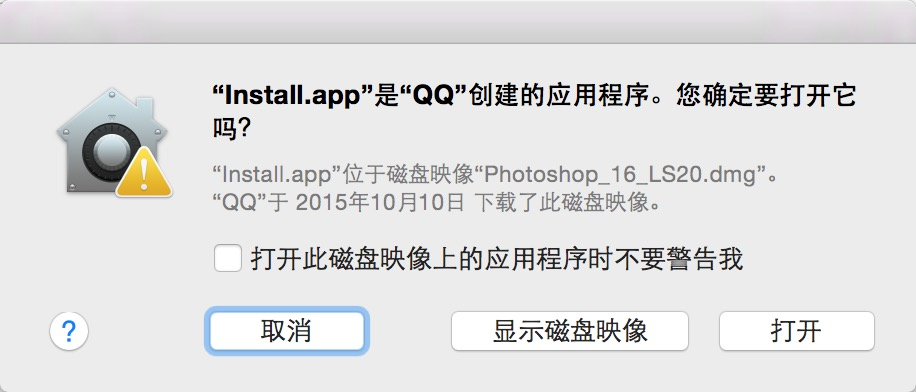
  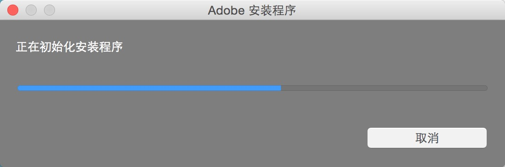

4. 初始化成功后，选择`试用`
  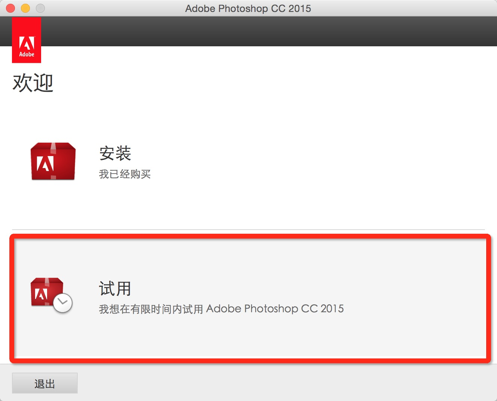

5. 选择`登录`，再选择`以后登录`
  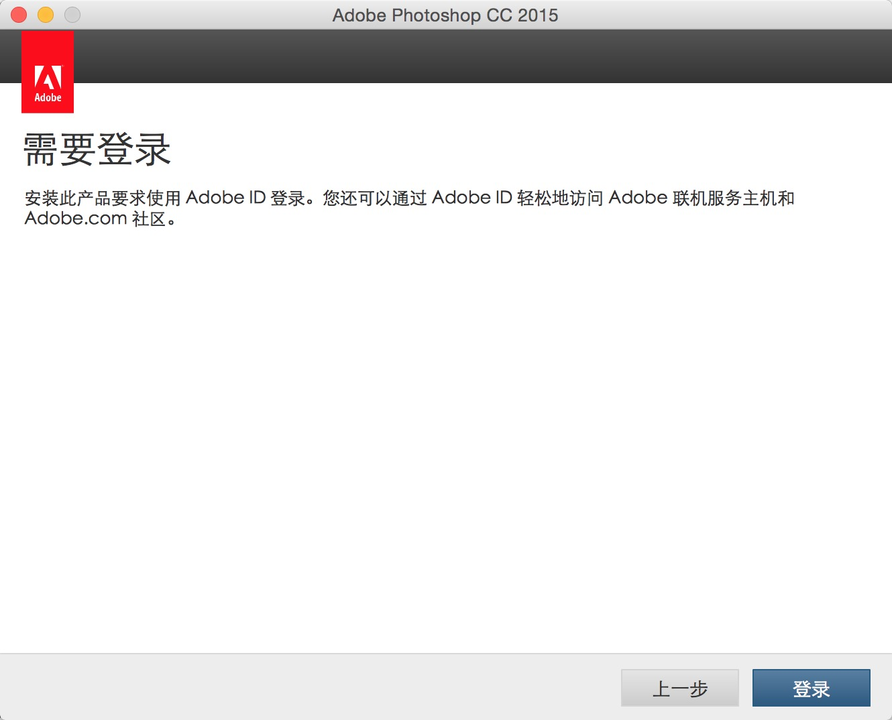
  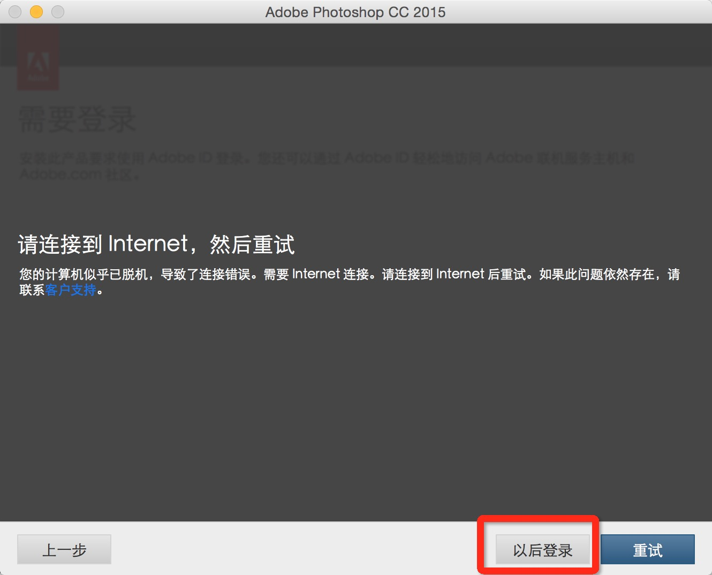

6. `接受`协议后，开始`安装`
  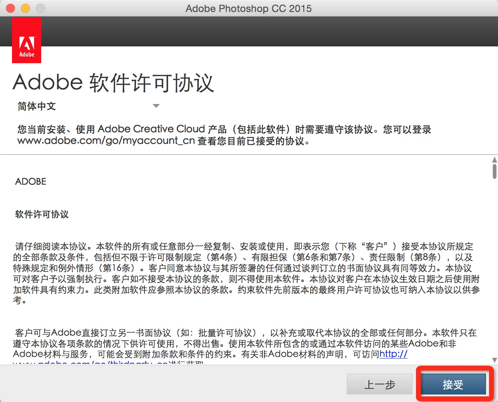
  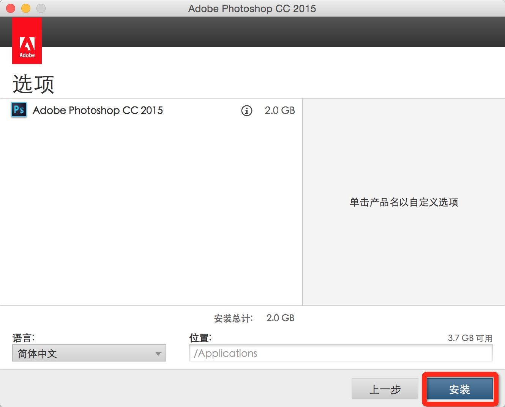

7. 需要输入本机的密码
  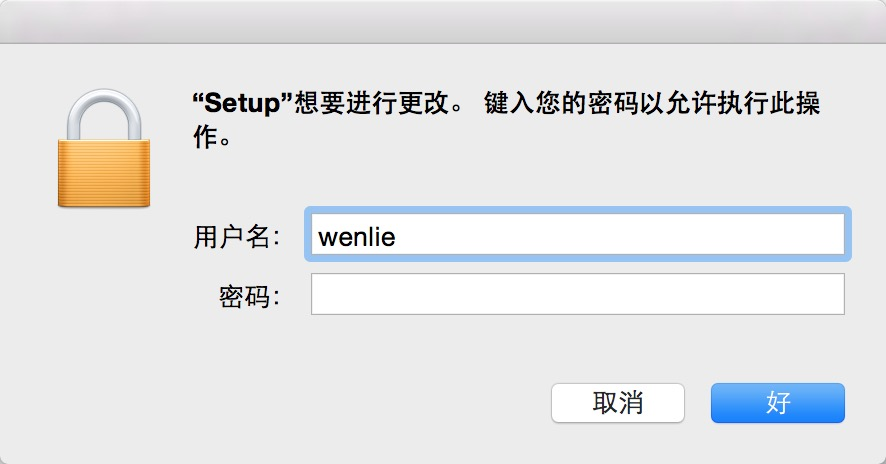
  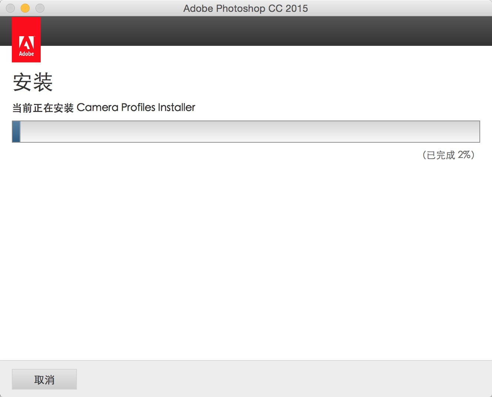

8. **特别注意**：到这一步，安装已经完成了。先别点击`任何按钮`。`不要立即启动`。先进行下一步，`破解`
  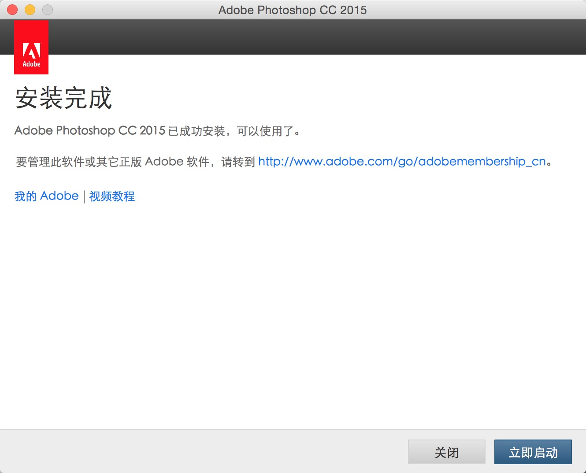

9. `破解`是最关键的一步，在`应用程序`里，找到刚刚安装的 `Adobe Photoshop CC 2015.app`，点击`右键`，`显示包内容`。
  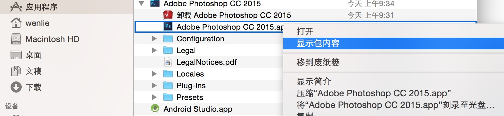

10. 把破解文件 `amtlib.framework` 复制到 `Contents/Frameworks` 文件中，并选择`替换`文件。
  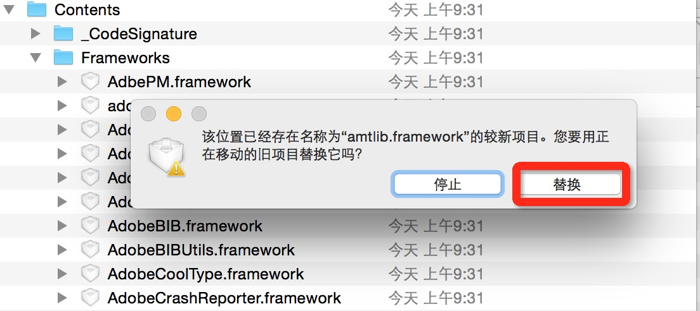

11. OK，大功告成。可以享用最新的PS了。
